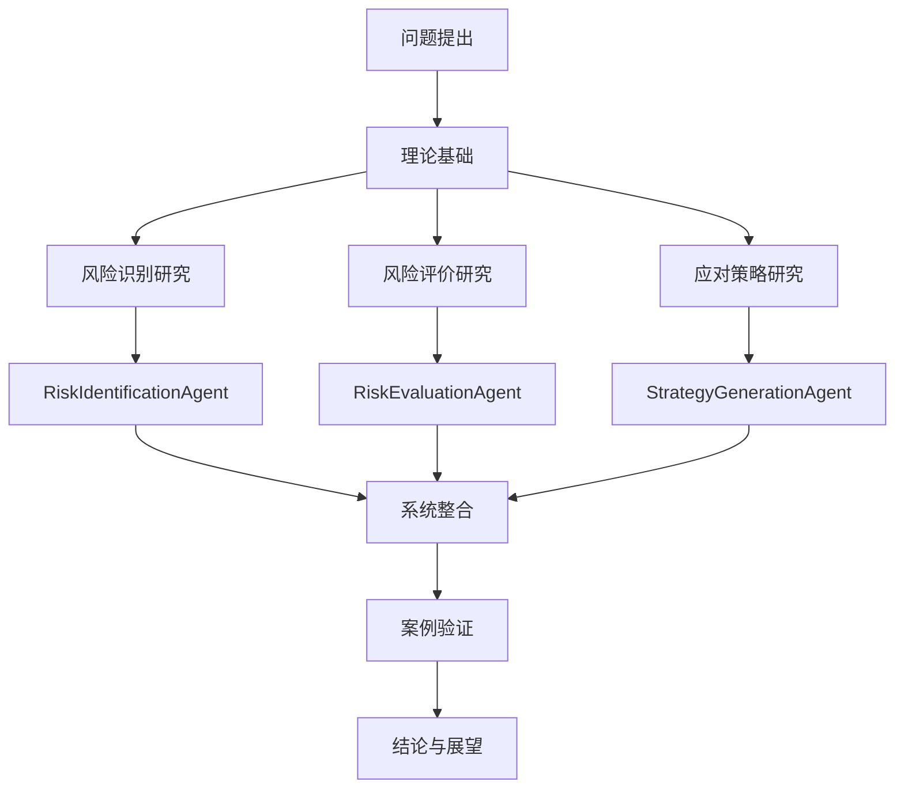

# 面向AI Agent全生命周期的科创项目风险评价与对策研究
## 硕士学位论文开题报告

| 项目 | 内容                            |
|------|-------------------------------|
| 论文题目 | 面向AI Agent全生命周期的科创项目风险评价与对策研究 |
| 学科专业 | 管理科学与工程 / 工程管理                |
| 研究方向 | 技术创新管理、项目风险管理                 |
| 课题类型 | 应用研究                          |
| 课题来源 | 自选课题（结合工程实践需求）                |

---

## 一、选题依据

### 1.1 研究背景与问题提出

#### 1.1.1 现实背景：科创项目的高风险特性
当前，以AI Agent为代表的新一代人工智能技术正在深刻改变科技创新范式。科创项目具有**"六高"特性**：
- **高创新性**：核心技术突破、新颖商业模式、自主知识产权
- **高投入性**：研发阶段需持续投入大量资金、高端设备和专业人才
- **高风险性**：技术研发失败率高、技术迭代速度快、不确定性强
- **高收益性**：成功产业化后可带来爆发式经济增长或垄断性优势
- **高成长性**：企业或项目规模具有短期内几何级数增长的潜力
- **政策依赖性**：高度契合国家产业导向，易获得财政补贴和政策扶持

其中，**技术风险是科创项目面临的核心挑战**。据统计，科创项目技术研发成功率不足30%，而技术迭代带来的替代风险更使大量项目在产业化后迅速被淘汰。

#### 1.1.2 理论背景：风险管理研究的不足
传统项目风险管理理论在科创场景下面临三重困境：
1. **识别困境**：风险识别依赖专家经验，主观性强、易遗漏
2. **评价困境**：风险评价方法单一，难以处理科创项目的模糊性和动态性
3. **应对困境**：风险应对策略静态滞后，难以适应技术快速迭代

#### 1.1.3 技术机遇：AI Agent技术的兴起
AI Agent技术的发展为解决上述困境提供了新机遇：
- 多智能体系统可实现风险识别、评价、应对的自动化与协同化
- 人机协同机制可结合AI的高效性与人类的经验智慧
- SPADE等Agent开发框架为系统实现提供了技术支撑

#### 1.1.4 问题提出
基于上述背景，本研究拟解决以下问题：
1. **问题1**：如何针对科创项目的TRL三阶段特性，构建系统化的技术风险识别框架？
2. **问题2**：如何设计科学的技术风险评价指标体系与量化模型？
3. **问题3**：如何利用AI Agent技术实现风险识别、评价、应对的半自动化？

### 1.2 研究意义

#### 1.2.1 理论意义
1. **拓展科创项目风险管理理论**：将TRL技术成熟度理论引入科创项目风险管理，构建全生命周期视角下的技术风险分析框架
2. **丰富AI应用研究领域**：探索多智能体系统在项目风险管理中的应用，拓展AI技术在管理科学中的应用场景
3. **完善人机协同理论**：构建"Agent自动处理+人工审核确认"的人机协同风险管理模式，丰富人机协同理论在管理领域的应用

#### 1.2.2 实践意义
1. **为科创企业提供风险管理工具**：开发可工程落地的风险管理Agent系统，帮助科创企业提升风险管理效率
2. **为投资机构提供决策支撑**：提供系统化的风险评价体系，辅助投资机构做出更科学的投资决策
3. **为政府部门提供政策参考**：为科创项目扶持政策的制定提供理论依据和实践参考

### 1.3 国内外研究现状及发展趋势

#### 1.3.1 科创项目风险管理研究
- **国外研究**：Cooper（2008）提出阶段-门（Stage-Gate）模型，将科创项目分为多个阶段进行风险管理；Keizer等人（2002）构建了科创项目风险识别框架；Tidd（2020）研究了开放式创新下的风险管理策略
- **国内研究**：陈劲等（2019）研究了科创项目的技术风险评价；许庆瑞等（2021）探讨了数字化转型下的科创风险管理；张维等（2022）构建了科创项目全生命周期风险预警体系
- **研究评述**：现有研究多集中于风险识别与评价方法，但在风险应对的自动化和智能化方面仍有不足

#### 1.3.2 AI Agent技术研究
- **国外研究**：Wooldridge（2009）奠定了多智能体系统的理论基础；Shoham（2008）提出面向Agent的软件工程方法；SPADE框架（2020）为多Agent系统开发提供了实用工具
- **国内研究**：史忠植等（2021）研究了Agent理论与技术；蔡自兴等（2022）探讨了多智能体协同控制；王飞跃（2023）研究了平行智能与Agent技术的结合
- **研究评述**：AI Agent技术在诸多领域已成功应用，但在项目风险管理领域的应用研究尚处于起步阶段

#### 1.3.3 技术成熟度TRL理论研究
- **国外研究**：NASA（2015）提出TRL九级标准；ESA（2018）将TRL应用于航天项目风险管理；GAO（2020）研究了TRL在重大科技项目中的应用
- **国内研究**：科技部（2019）发布《科技计划项目技术成熟度评价指南》；李一军等（2021）将TRL应用于科技成果转化评价；张光斗等（2022）研究了TRL与风险的关联机制
- **研究评述**：TRL理论已相对成熟，但将TRL与风险管理深度结合的研究仍有不足

#### 1.3.4 发展趋势
1. **智能化趋势**：AI技术在风险管理中的应用将越来越广泛
2. **全生命周期趋势**：从单一阶段风险研究向全生命周期风险研究转变
3. **人机协同趋势**：从完全依赖人工或完全依赖AI向人机协同模式转变

---

## 二、研究内容与研究方法

### 2.1 核心概念界定

#### 2.1.1 科创项目
本研究中的科创项目是指以科学研究和技术创新为核心，旨在解决特定技术难题、开发新产品或提升产业竞争力的创新性项目，具有高投入、高风险、高收益的特征。

#### 2.1.2 技术风险
技术风险是指由于技术不成熟、技术迭代、资源不足等因素导致的项目失败或未达预期的可能性。本研究将技术风险细分为：
- **技术研发风险**（TRL 1-6）：技术实现难度、技术瓶颈、替代技术
- **技术迭代风险**（TRL 7-9）：技术过时、替代威胁、生态依赖

#### 2.1.3 技术成熟度TRL
技术成熟度（Technology Readiness Level, TRL）是衡量技术成熟程度的九级标准：
- **TRL 1-3**：实验室原理验证阶段
- **TRL 4-6**：中试验证阶段
- **TRL 7-9**：产业化应用阶段

#### 2.1.4 AI Agent与多智能体系统
AI Agent是指具有感知、推理、决策、行动能力的智能体。多智能体系统是由多个Agent组成的协同系统，各Agent通过交互合作实现共同目标。

### 2.2 研究内容

本文以AI Agent技术为工具，研究科创项目全生命周期技术风险的识别、评价与应对策略，主要研究内容如下：

#### 研究内容一：基于TRL三阶段的科创项目技术风险识别
- **子内容1.1**：构建基于TRL三阶段的技术风险识别框架
  - 分析TRL 1-3（实验室阶段）的技术风险特征
  - 分析TRL 4-6（中试阶段）的技术风险特征
  - 分析TRL 7-9（产业化阶段）的技术风险特征
- **子内容1.2**：构建技术风险知识规则库
  - 文献梳理科创项目技术风险清单
  - 专家访谈补充与完善风险清单
  - 将风险清单转化为Agent可执行的规则
- **子内容1.3**：设计RiskIdentificationAgent
  - 基于SPADE框架设计Agent架构
  - 实现关键词匹配与风险自动识别功能
  - 设计人工审核接口与交互机制

#### 研究内容二：科创项目技术风险评价体系构建
- **子内容2.1**：设计三维评价指标体系
  - 构建"发生概率-影响程度-紧急程度"三维评价指标
  - 定义1-5级评分标准与量化规则
  - 采用AHP法确定指标权重
- **子内容2.2**：构建模糊综合评价模型
  - 建立因素集、评价集、权重集
  - 构建模糊关系矩阵
  - 计算综合风险值与风险等级
- **子内容2.3**：设计RiskEvaluationAgent
  - 实现评价指标自动采集与计算功能
  - 实现异常检测、矛盾检测、遗漏检测功能
  - 设计评价结果可视化与人机协同审核机制

#### 研究内容三：基于多Agent的风险应对策略生成
- **子内容3.1**：构建应对策略知识库
  - 梳理"规避-转移-缓解-接受"四类应对策略
  - 建立风险类型-风险等级-应对策略的映射规则
  - 为每种组合设计2-3条候选策略（约40-60条规则）
- **子内容3.2**：设计StrategyGenerationAgent
  - 基于FSM有限状态机实现策略生成流程
  - 实现策略推荐与解释功能
  - 支持人工策略调整与优化
- **子内容3.3**：构建人机协同风险管理系统
  - 整合三个Agent为统一系统
  - 设计命令行交互界面
  - 实现风险应对计划表的自动生成与Word导出

### 2.3 研究方法

#### 2.3.1 文献研究法
- 系统梳理科创项目风险管理、AI Agent技术、TRL理论的相关文献
- 构建技术风险清单与评价指标体系的理论基础

#### 2.3.2 专家访谈法
- 访谈5-8位科创项目管理专家、AI技术专家
- 补充完善风险清单、评价指标、应对策略

#### 2.3.3 层次分析法（AHP）
- 构建技术风险评价的层次结构
- 确定各评价指标的权重
- 检验判断矩阵的一致性

#### 2.3.4 模糊综合评价法
- 处理风险评价中的模糊性与不确定性
- 计算综合风险值与风险等级
- 实现风险评价的量化

#### 2.3.5 系统开发法
- 基于SPADE框架开发多Agent风险管理系统
- 实现风险识别、评价、应对的半自动化
- 验证系统的有效性与实用性

#### 2.3.6 案例分析法
- 选择1-2个真实的AI Agent科创项目作为案例
- 应用研究成果进行全流程风险管理
- 验证研究方法与系统的有效性

### 2.4 技术路线

**技术路线说明**：
1. **问题提出与理论准备**（第1-2章）：分析问题，梳理理论
2. **三个核心研究内容**（第3-5章）：分别研究风险识别、评价、应对，并设计相应Agent
3. **系统整合与验证**（第6章）：整合三个Agent，通过案例验证效果
4. **结论总结**（第7章）：总结研究成果，展望未来方向

---

## 三、研究特色与创新点

### 3.1 研究特色

#### 特色1：全生命周期视角与TRL理论的结合
- 突破传统单一阶段风险研究的局限
- 将TRL技术成熟度理论与风险管理深度结合
- 针对不同TRL阶段的特点设计差异化的风险管理策略

#### 特色2：人机协同的风险管理模式
- 既发挥AI Agent的高效性、客观性
- 又保留人类专家的经验智慧与主观判断
- 构建"Agent执行+人工审核"的双层质量保障机制

#### 特色3：理论研究与系统开发并重
- 既有理论层面的风险识别框架、评价模型
- 又有实践层面的可工程落地的多Agent系统
- 实现从理论到实践的完整闭环

### 3.2 核心创新点

#### 创新点1：构建了基于TRL三阶段的科创项目技术风险识别框架
- **创新内容**：将TRL理论引入科创项目技术风险识别，针对TRL 1-3、TRL 4-6、TRL 7-9三个阶段的不同特征，构建差异化的风险识别清单与规则库
- **理论价值**：拓展了TRL理论的应用场景，完善了科创项目风险识别理论
- **实践价值**：为不同阶段科创项目的风险识别提供了系统化工具

#### 创新点2：提出了"三维度+双保障"的技术风险评价体系
- **创新内容**：设计"发生概率-影响程度-紧急程度"三维评价指标，采用AHP+模糊综合评价模型，同时构建"Agent自动检测+人工复核"的双保障机制
- **理论价值**：丰富了科创项目风险评价方法体系
- **实践价值**：提高了风险评价的科学性、客观性与可靠性

#### 创新点3：开发了基于SPADE的多Agent协同风险管理系统
- **创新内容**：设计RiskIdentificationAgent、RiskEvaluationAgent、StrategyGenerationAgent三个专业化Agent，构建集"识别-评价-应对"于一体的人机协同风险管理系统
- **理论价值**：探索了多智能体系统在项目风险管理领域的应用
- **实践价值**：为科创企业提供了可工程落地的风险管理智能化工具

---

## 四、研究计划与进度安排

### 4.1 研究计划（总时间：18个月）

| 阶段 | 时间 | 主要工作内容 | 交付成果 |
|------|------|-------------|---------|
| **第一阶段** | 第1-3个月 | 文献调研、理论梳理、专家访谈 | 文献综述报告、访谈记录 |
| **第二阶段** | 第4-6个月 | 风险识别框架构建、规则库设计 | 风险识别清单、规则库文档 |
| **第三阶段** | 第7-9个月 | 评价指标体系设计、AHP+模糊评价建模 | 评价指标体系、评价模型 |
| **第四阶段** | 第10-12个月 | 多Agent系统设计与开发 | 风险管理系统原型 |
| **第五阶段** | 第13-15个月 | 案例应用与验证、系统优化 | 案例分析报告、优化后系统 |
| **第六阶段** | 第16-18个月 | 论文撰写、修改、答辩 | 学位论文 |

### 4.2 关键里程碑

- **里程碑1**（第3个月）：完成文献综述，确定研究框架
- **里程碑2**（第6个月）：完成风险识别框架与规则库
- **里程碑3**（第9个月）：完成评价指标体系与评价模型
- **里程碑4**（第12个月）：完成多Agent系统开发
- **里程碑5**（第15个月）：完成案例验证，系统优化
- **里程碑6**（第18个月）：完成论文，通过答辩

---

## 五、预期研究成果

### 5.1 理论成果
1. **学术论文**：完成硕士学位论文1篇，预计3-5万字
2. **期刊论文**：争取发表核心期刊论文1-2篇
3. **理论框架**：构建基于TRL的科创项目技术风险管理理论框架

### 5.2 实践成果
1. **风险管理系统**：开发基于SPADE的多Agent风险管理系统1套
2. **技术文档**：形成完整的系统设计文档、用户手册
3. **案例报告**：完成1-2个AI Agent科创项目的风险管理案例报告

### 5.3 人才培养
1. **个人能力提升**：提升科研能力、系统开发能力、论文写作能力
2. **知识积累**：系统掌握科创项目风险管理、AI Agent技术等知识

---

## 六、研究条件与可行性分析

### 6.1 研究条件

#### 6.1.1 理论基础
- 已系统学习项目风险管理、人工智能、管理科学方法等相关课程
- 已查阅大量相关文献，对研究领域有较深入了解

#### 6.1.2 技术条件
- 已掌握Python编程、SPADE框架使用
- 具备系统开发、数据分析能力
- 有充足的计算资源与开发环境

#### 6.1.3 案例来源
- 可通过导师、实习单位等渠道获取AI Agent科创项目案例
- 已有相关企业的合作意向

### 6.2 可行性分析

#### 6.2.1 理论可行性
- 科创项目风险管理理论、TRL理论、AI Agent理论均较成熟
- 研究方法（AHP、模糊综合评价）已在相关领域广泛应用
- 研究思路清晰，逻辑合理

#### 6.2.2 技术可行性
- SPADE等Agent开发框架成熟稳定
- 系统开发难度适中，在预期时间内可完成
- 已有相关技术储备

#### 6.2.3 实践可行性
- 案例来源有保障
- 研究成果具有实际应用价值
- 预期可获得企业支持与验证

---

## 七、参考文献（示例）

[1] Cooper R G. Winning at new products: accelerating the process from idea to launch[M]. Basic books, 2008.

[2] Keizer J A, Halman J I M, Song M. From experience: applying the risk diagnosing methodology[J]. Journal of Product Innovation Management, 2002, 19(3): 213-232.

[3] Tidd J, Bessant J. Managing innovation: integrating technological, market and organizational change[M]. John Wiley & Sons, 2020.

[4] Wooldridge M. An introduction to multi-agent systems[M]. John Wiley & Sons, 2009.

[5] 陈劲, 王方瑞. 中国技术创新管理研究的演进脉络与前沿热点[J]. 管理世界, 2019, 35(10): 15-24.

[6] 许庆瑞. 全面创新管理: 理论与实践[M]. 科学出版社, 2021.

[7] 科技部. 科技计划项目技术成熟度评价指南[Z]. 2019.

[8] 史忠植. 智能科学[M]. 清华大学出版社, 2021.

---

## 八、附录

### 附录A：开题报告审查意见表（略）
### 附录B：专家访谈提纲（略）
### 附录C：风险识别清单初稿（略）

